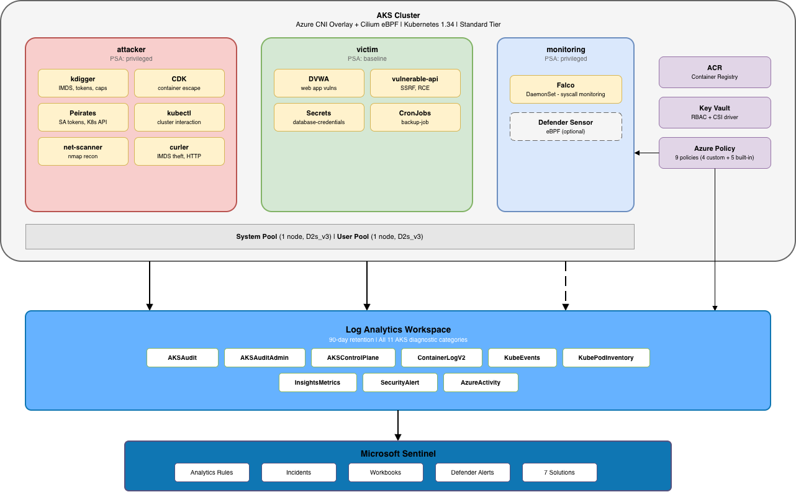

# AKS Adversary Lab
A comprehensive AKS-based cybersecurity lab environment designed for security professionals to practice container threat detection, incident response, adversary emulation, and Kubernetes security monitoring using Microsoft Sentinel and Azure security services.

Extension of [Adversary Lab](https://github.com/purpleshellsecurity/adversary_lab) for **Azure Kubernetes Service**

## Overview

The AKS Adversary Lab provides a complete container security monitoring environment that includes:

- **AKS Cluster** with Azure CNI Overlay + Cilium eBPF dataplane
- **Microsoft Sentinel** SIEM/SOAR with 7 container-focused solutions
- **Log Analytics Workspace** with all 11 AKS diagnostic categories
- **Container Insights** for pod/node inventory, container logs, and metrics
- **Microsoft Defender for Containers** eBPF sensor for runtime detection (optional)
- **Azure Policy Initiative** with 10 security policies (5 custom + 5 built-in)
- **Azure Container Registry** with diagnostic logging
- **Key Vault** with CSI integration and diagnostic logging
- **Falco** runtime security with custom syscall-based rules
- **Red Team Tools** — kdigger, CDK, Peirates, kubectl, nmap, curl/wget
- **Victim Applications** — DVWA, vulnerable API, intentional misconfigs

## Repository Structure

```
aks-adversary-lab/
├── README.md                                # Documentation
├── aks_adversary_lab_deploy.ps1             # Main deployment script
├── main.bicep                               # Resource Group deployment orchestration
├── main_subscription.bicep                  # Subscription-level resources
│
├── img/                                     # Architecture diagram
│   └── diagram.png                          # Lab architecture overview
│
├── modules/                                 # Bicep modules (layered architecture)
│   ├── log_analytics.bicep                  # Log Analytics workspace (90-day retention)
│   ├── aks_networking.bicep                 # VNet, 3 subnets, NSGs
│   ├── aks_cluster.bicep                    # AKS with full security profile
│   ├── aks_diagnostics.bicep                # All 11 diagnostic categories
│   ├── container_insights.bicep             # DCR + DCRA for Container Insights
│   ├── aks_acr.bicep                        # Azure Container Registry + diagnostics
│   ├── aks_acr_role.bicep                   # AcrPull role assignment
│   ├── aks_keyvault.bicep                   # Key Vault with RBAC + diagnostics
│   ├── aks_sentinel.bicep                   # Sentinel + 7 solutions
│   ├── aks_policy_defs.bicep                # Policy definitions + initiative (subscription)
│   └── aks_policy.bicep                     # Policy assignment + roles (RG scope)
│
├── kubernetes/                              # Kubernetes manifests
│   ├── namespaces/namespaces.yaml           # 4 namespaces with PSA labels
│   ├── monitoring/container-insights-config.yaml  # ContainerLogV2 schema config
│   ├── network-policies/                    # Cilium network policies per namespace
│   ├── rbac/rbac.yaml                       # Roles, bindings, intentional misconfigs
│   ├── red-team/red-team-tools.yaml         # kdigger, CDK, Peirates, kubectl, nmap, curler
│   ├── blue-team/falco-values.yaml          # Falco Helm values with custom rules
│   └── victim-apps/victim-apps.yaml         # DVWA, vulnerable API, test secrets
│
└── cheatsheets/                             # Reference guides
    └── KQL_Container_Reference.md           # Query examples for every log table
```

## Architecture



## Prerequisites

### Required Software

| Software | Windows | macOS |
|----------|---------|-------|
| PowerShell 7 | `winget install --id Microsoft.PowerShell` | `brew install --cask powershell` |
| Azure PowerShell | `Install-Module -Name Az -Force` | `Install-Module -Name Az -Force` |
| Azure CLI | `winget install -e --id Microsoft.AzureCLI` | `brew install azure-cli` |
| Bicep CLI | `winget install -e --id Microsoft.Bicep` | `az bicep install` |
| kubectl | `winget install -e --id Kubernetes.kubectl` | `brew install kubectl` |
| kubelogin | `az aks install-cli` | `brew install kubelogin` |
| Helm | `winget install -e --id Helm.Helm` | `brew install helm` |

### Azure Requirements

- Azure subscription with **Contributor** permissions
- Ability to create resources at both **Resource Group** and **Subscription** levels
- Entra ID security group for AKS cluster-admin access

## Quick Start

### 1. Clone the Repository

```powershell
git clone https://github.com/purpleshellsecurity/aks-adversary-lab.git
cd aks-adversary-lab
```

### 2. Deploy the Lab

```powershell
# Default (Defender disabled for cost savings)
./aks_adversary_lab_deploy.ps1

# With Defender for Containers enabled
./aks_adversary_lab_deploy.ps1 -EnableDefender $true
```

The script auto-generates a unique lab ID (e.g., `aks-adversary-lab-x7k2m9`) so each deployment is isolated. It will prompt for:
- Subscription selection
- Deployment region
- Entra ID Admin Group Object ID
- Public IP for API server access (auto-detected)
- Deployment confirmation with cost estimate

> [!NOTE]
> If you encounter an execution policy error:
> ```powershell
> powershell -ExecutionPolicy Bypass -File .\aks_adversary_lab_deploy.ps1
> ```

> [!WARNING]
> This lab creates real Azure resources that incur costs. Monitor your spending and use the [Azure Pricing Calculator](https://azure.microsoft.com/en-us/pricing/calculator/) for estimates.

### 3. Post-Deploy Setup

```bash
# Configure kubectl
kubelogin convert-kubeconfig -l azurecli
kubectl get nodes

# Apply manifests (if not auto-applied)
kubectl apply -f kubernetes/namespaces/namespaces.yaml
kubectl apply -f kubernetes/network-policies/victim-netpol.yaml
kubectl apply -f kubernetes/network-policies/attacker-netpol.yaml
kubectl apply -f kubernetes/network-policies/monitoring-netpol.yaml
kubectl apply -f kubernetes/rbac/rbac.yaml
kubectl apply -f kubernetes/victim-apps/victim-apps.yaml

# Install Falco
helm repo add falcosecurity https://falcosecurity.github.io/charts
helm install falco falcosecurity/falco -n monitoring -f kubernetes/blue-team/falco-values.yaml

# Deploy red team tools
kubectl apply -f kubernetes/red-team/red-team-tools.yaml

# Begin attack simulations
kubectl exec -it peirates -n attacker -- /bin/sh
```

### 4. Verify Data Collection

Wait 10-15 minutes, then validate:

```kql
// AKS Audit logs
AKSAudit | where TimeGenerated > ago(1h) | summarize count() by bin(TimeGenerated, 5m)

// Container Insights
ContainerLogV2 | where TimeGenerated > ago(1h) | summarize count() by PodNamespace

// Defender alerts (if enabled)
SecurityAlert | where TimeGenerated > ago(24h) | where ProductName has "Defender" | take 10
```

> [!NOTE]
> Defender for Containers needs 15-30 minutes to initialize. Container Insights tables may take 10-15 minutes to populate.

## Deployed Components

### Core Infrastructure

| Component | Description |
|-----------|-------------|
| AKS Cluster | K8s 1.34, Azure CNI Overlay + Cilium, Workload Identity |
| Virtual Network | 10.0.0.0/16 with system, user, and services subnets + NSGs |
| Container Registry | Standard SKU, managed identity pull, diagnostic logging |
| Key Vault | RBAC-enabled, CSI driver integration, diagnostic logging |
| Log Analytics | 90-day retention, all 11 AKS diagnostic categories |

### Monitoring & Security

| Component | Description |
|-----------|-------------|
| Microsoft Sentinel | SIEM/SOAR with 7 container-focused solutions |
| Container Insights | ContainerLogV2, KubeEvents, KubePodInventory, InsightsMetrics |
| Defender for Containers | Optional — eBPF runtime sensor for binary drift, crypto mining, escape detection |
| Azure Policy Initiative | 10 policies enforcing logging, pod security, network policy, RBAC, Key Vault diagnostics |
| Falco | Runtime security with custom rules for SA token theft, container escape, reverse shells, crypto mining |

### Log Tables

| Table | Source | Key Detections |
|-------|--------|---------------|
| AKSAudit | API server (all ops) | exec, pod creation, secret access, RBAC changes |
| AKSAuditAdmin | API server (mutations) | RBAC escalation, daemonset creation, deletions |
| AKSControlPlane | guard, scheduler | auth failures, admission denials |
| ContainerLogV2 | Container stdout/stderr | crypto mining, token access, reverse shells |
| KubeEvents | Pod lifecycle | crash loops, image pull failures, OOMKills |
| KubePodInventory | Pod metadata | namespace drift, unexpected images |
| InsightsMetrics | CPU/memory/network | mining detection via CPU anomalies |
| SecurityAlert | Defender | binary drift, web shells, escape attempts |
| AzureActivity | ARM operations | resource deletions, policy changes |


## Cheatsheets

| Guide | Description |
|-------|-------------|
| [KQL Container Reference](cheatsheets/KQL_Container_Reference.md) | Query examples for every AKS log table with field breakdowns |

## Cost Management

### Estimated Monthly Costs (default deployment)

| Resource | Monthly Cost |
|----------|-------------|
| AKS Standard tier (control plane) | ~$73 |
| 1× D2s_v3 system node | ~$70 |
| 1× D2s_v3 user node | ~$70 |
| Log Analytics (90-day, ~5GB/day) | ~$35 |
| ACR Standard | ~$5 |
| **Total (running 24/7)** | **~$253/month** |
| **With `-EnableDefender $true`** | **~$281/month** |

### Cost Reduction Tips

**Stop the cluster when not in use** — this is the single biggest savings:

```bash
# Stop (pay nothing for compute)
az aks stop --resource-group <rg> --name <cluster>

# Start
az aks start --resource-group <rg> --name <cluster>
```

A lab running 20 hours/month instead of 24/7 drops compute costs by ~90%.

**Scale user pool to 0 between sessions:**

```bash
az aks nodepool scale -g <rg> --cluster-name <cluster> --name seclab --node-count 0
```

## Troubleshooting

### Deployment Failures

- Ensure Bicep CLI is current: `az bicep upgrade`
- Check all files in `modules/` directory are present
- Check Azure region availability for your VM sizes
- Check vCPU quota: default deployment needs 4 vCPUs (2 per node)
- Review deployment errors in Azure Portal > Resource Group > Deployments

### kubectl Connectivity

- Install kubelogin: `az aks install-cli` or `brew install kubelogin`
- Convert kubeconfig: `kubelogin convert-kubeconfig -l azurecli`
- Verify: `kubectl get nodes`

### Data Collection Issues

- Wait 15-30 minutes for initial ingestion
- Verify Container Insights: `az aks show -g <rg> -n <cluster> --query "addonProfiles.omsagent"`
- Check diagnostic settings in Azure Portal for ACR and Key Vault
- Verify Defender (if enabled): `kubectl get pods -n kube-system | grep defender`

## Cleanup

All lab resources are contained in a single auto-named resource group:

```powershell
Remove-AzResourceGroup -Name "aks-adversary-lab-<your-suffix>" -Force

# Clean up subscription-level policy definitions
Remove-AzPolicySetDefinition -Name 'aks-adversary-lab-logging-initiative' -Force -ErrorAction SilentlyContinue
Remove-AzPolicyDefinition -Name 'aks-dine-all-diag-categories' -Force -ErrorAction SilentlyContinue
Remove-AzPolicyDefinition -Name 'aks-require-network-policy' -Force -ErrorAction SilentlyContinue
Remove-AzPolicyDefinition -Name 'aks-require-defender-sensor' -Force -ErrorAction SilentlyContinue
Remove-AzPolicyDefinition -Name 'aks-require-entra-rbac' -Force -ErrorAction SilentlyContinue
Remove-AzPolicyDefinition -Name 'kv-dine-diagnostic-settings' -Force -ErrorAction SilentlyContinue
```

## Contributing

Contributions welcome! Areas for enhancement:
- Additional Sentinel analytics rules
- Custom attack simulation scripts
- Grafana dashboards
- Cost optimization features

## Additional Resources

- [MITRE ATT&CK Containers Matrix](https://attack.mitre.org/matrices/enterprise/containers/)
- [Microsoft Sentinel Documentation](https://docs.microsoft.com/en-us/azure/sentinel/)
- [AKS Security Best Practices](https://learn.microsoft.com/en-us/azure/aks/best-practices)
- [KQL Quick Reference](https://docs.microsoft.com/en-us/azure/data-explorer/kql-quick-reference)
- [Defender for Containers](https://learn.microsoft.com/en-us/azure/defender-for-cloud/defender-for-containers-introduction)

> [!NOTE]
> **Ready to start building detections?** Join [Adversary Lab Community](https://www.skool.com/adversary-lab-community/about)

## License

This project is licensed under the [MIT License](LICENSE).

> ⚠️ **Disclaimer:** This project deploys intentionally vulnerable workloads and offensive tools. Deploy only in isolated subscriptions you control. Do not deploy within any tenant other than your own without prior authorization and written consent.
